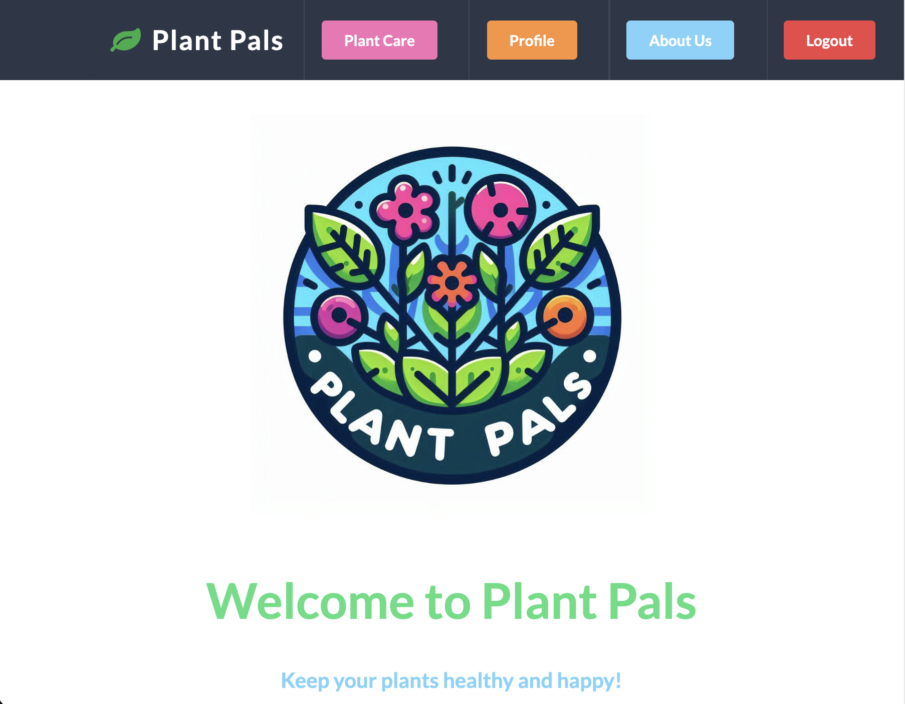
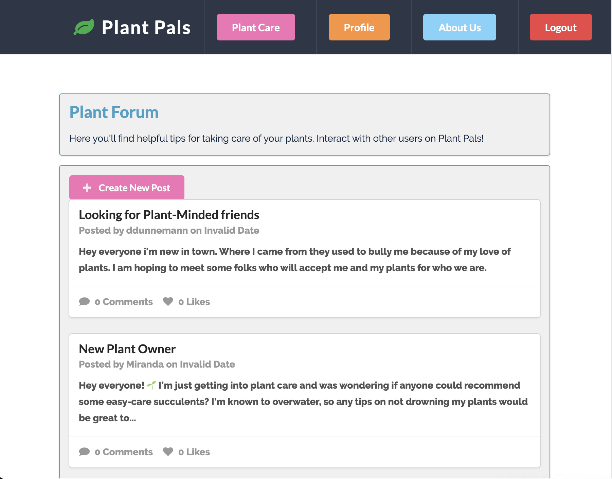
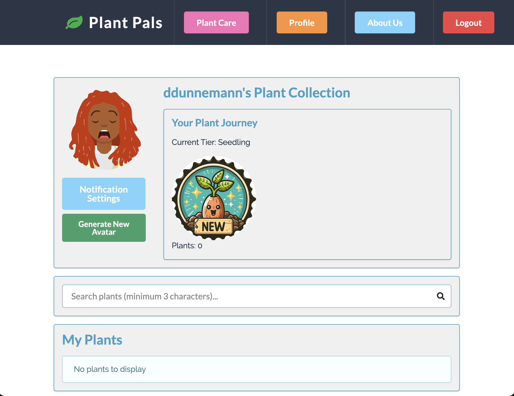

# Plant Pals

### A plant management and social forum application. 🌿 Grow your own plant kingdom, connect with fellow plant lovers, and unlock your inner green thumb! 🌱

## Table of Contents

- [Project Overview](#project-overview)
- [Features](#features)
- [Technologies Used](#technologies-used)
- [Installation](#installation)
- [Usage](#usage)
- [API Integration](#api-integration)
- [Contributing](#contributing)
- [License](#license)

## Project Overview

Welcome to **Plant Pals** — the ultimate companion for plant enthusiasts! Whether you're a seasoned gardener or just starting your plant journey, Plant Pals is here to help you build and nurture your plant collection while engaging with a thriving community of plant lovers.

With Plant Pals, you can search through a vast database of plants, add your favorites to a personal collection, and earn badges as your plant family grows! Share your green wisdom, ask questions, and offer advice in the forum section. Your plant care journey is gamified, so the more plants you collect, the higher your status as a plant expert grows. From "Seedling" to "Pro Botanist," each tier unlocks fun badges and new challenges!

Let’s grow together and bring some greenery into our daily lives — one plant at a time! 🌵🌸🌻

## Features

- **User Authentication**: Sign up, log in, and manage a personal profile.
- **Plant Management**: Search plants using integrated APIs and add them to personal collections.
- **Gamification**: Earn badges and levels based on the number of plants in the user's collection.
- **Forum**: Users can create posts, comment on posts, and engage with others in a plant care community.
- **Responsive Design**: The app is designed to be responsive across all device sizes.
- **Progressive Web Application & Service Worker**: Plant Pals employs a custom Service Worker that enhances accessibility and allows users to set up push notifications.

## Screenshots

| Home Page                            | Plant Care Forum                             | Profile                               |
| ------------------------------------ | -------------------------------------------- | ------------------------------------- |
|  |  |  |

## Technologies Used

- **Frontend**: React, Semantic UI React for styling, Apollo Client for GraphQL interactions, Service Worker for caching and PWA.
- **Backend**: Node.js, Express.js, MongoDB, Apollo Server for handling GraphQL queries/mutations, node-cron for scheduling background tasks, web-push for sending push notifications.
- **Database**: MongoDB with Mongoose for schema modeling.
- **API**: Integrated with the **Perenual API** for plant searches.

## Installation

1. Clone the repository:

   ```bash
   git clone https://github.com/yourusername/plant-pals.git
   cd plant-pals
   ```

2. Install the dependencies:

   ```bash
   npm install
   ```

3. Set up environment variables:
   - Create a `.env` file in both client and server directories.
   - Set up environment variables for API keys (such as Perenual), database connection (MongoDB URI), and authentication (JWT secret, VAPID keys, etc.).
4. Start the development server:

   ```bash
   npm run dev
   ```

   This will start both the frontend and backend servers.

## Usage

- **Search Plants**: Use the search bar on the home page to find specific plants from the API.
- **Manage Plants**: Add plants to your collection and see them reflected in your profile with gamification badges based on plant count.
- **Create Posts**: Navigate to the forum section and create new posts. Comment on others' posts to engage with the community.

### Key Files and Folders:

- `client/src/components/` - Contains reusable React components.
- `server/models/` - MongoDB models for users, posts, plants, and comments.
- `server/resolvers.js` - GraphQL resolvers for queries and mutations.
- `server/typeDefs.js` - GraphQL schema definitions.

## API Integration

- **Perenual API**: The app integrates with [Perenual API](https://perenual.com/) to fetch plant data based on user search terms. This API provides plant information such as species, sunlight needs, and watering frequency.

  In order to make API requests, ensure you have a valid API key from the Perenual API and set it up in your `.env` file as follows:

You can sign up for a free Perenual API key [here](https://perenual.com/signup).

## Contributing

We welcome contributions! If you would like to contribute to Plant Pals, please fork the repository and submit a pull request. Please follow the existing code style and conventions.

1. Fork the repository
2. Create a new feature branch

```bash
git checkout -b feature-name
```

3. Commit your changes

```bash
git commit -m 'Add some feature'
```

4. Push to the branch

```bash
git push origin feature-name
```

5. Create a pull request

## License

N/A

## Collaborators 🤝

This project is a collaborative effort. Our team members are:

- [jknowles10](https://github.com/jknowles10)
- [daniels-pancakes](https://github.com/daniels-pancakes)
- [mlipscomb24](https://github.com/mlipscomb24)
- [Hamszn](https://github.com/Hamszn)

We appreciate the hard work and contributions of all team members in making this project possible.
